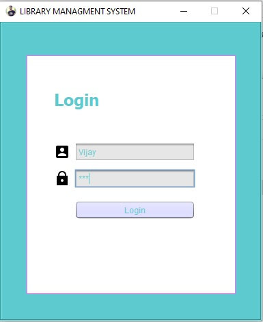
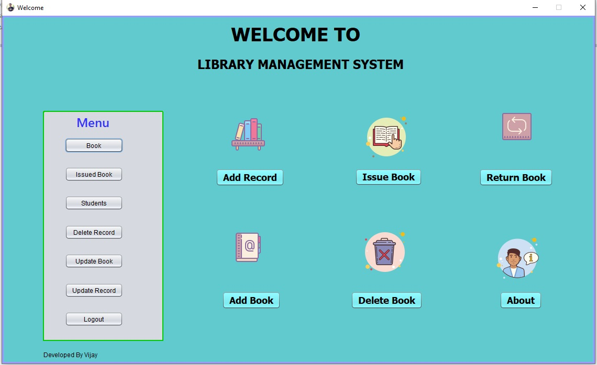

# Library_Managment_System
A college minor project. "This Project Written in Java Language."

How to use : 
1. Extract zip file.
2. Open NetBeans and Select "Open Project" option.
3. Location Location where you Extracted zip file.
4. Select an enjoy.
5. Login ID = Vijay
6. Login Password = 123

Problems :
1. There are only one problem which are database file location.
2. If you encounter this problem, change the database location from every java classes.

For Contect to me use social links from my profile.
